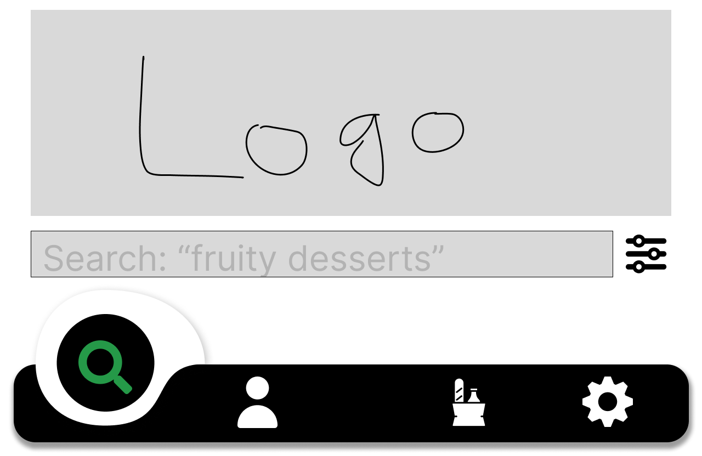
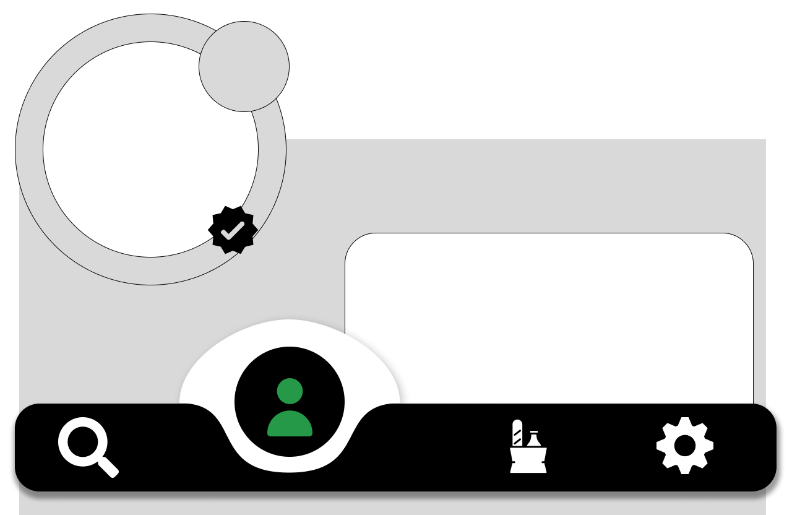
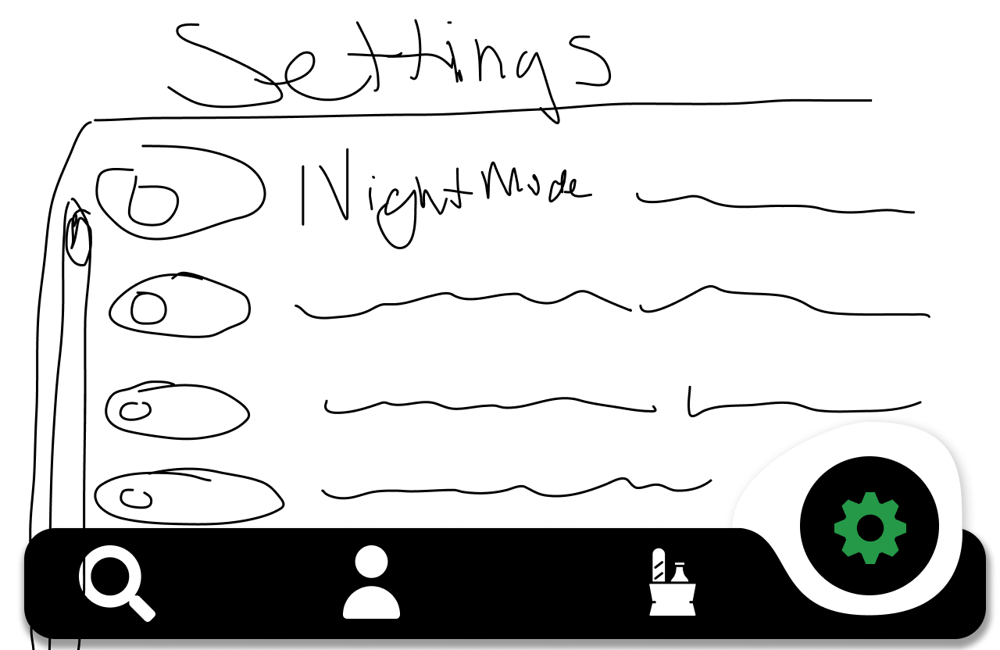
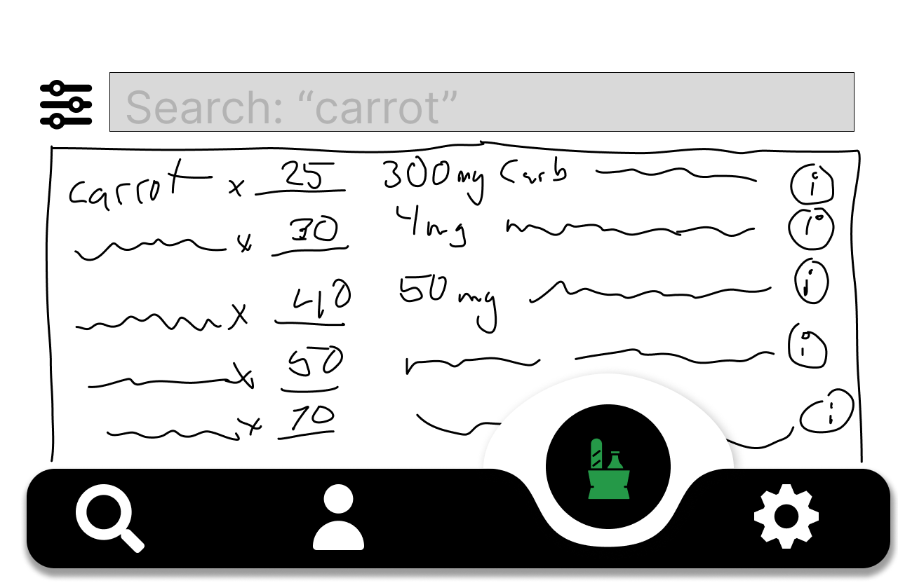
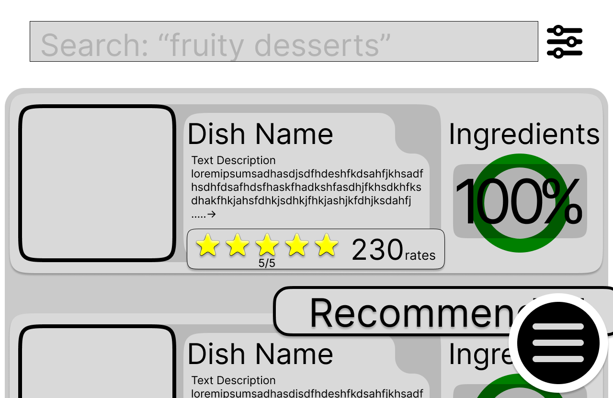
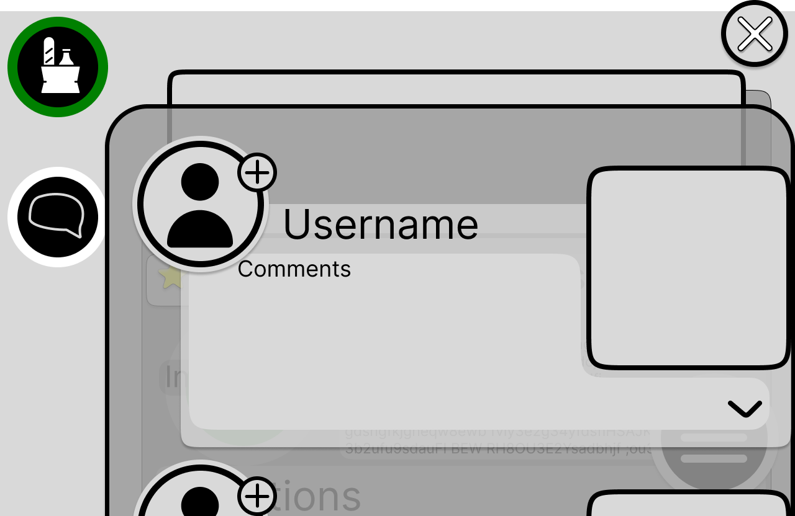

# MyKitchen Website Application - README

## Overview
Uses provided ingredient information (photo or text box) to search and display images and recipes of food items that you can make with the provided ingredients. The recipes & ingredients are gathered from a database while also being provided by other users.

### App Evaluation
- **Category**: Social Networking / Culinary
- **Story**: Analyzes food items and provides recipes using those items. Users can make the recipes and post reviews or comments.
- **Market**: Accessible to all who want to grow their culinary network.
- **Habit**: Users can utilize the app as frequently as they want to learn new recipes.
- **Scope**: Initially launching in America, with plans to expand globally to broaden the database of recipes.

---

## Product Spec

### 1. User Stories (Required and Optional)

- **Required**:
    - Profile pages for each user
    - A search and filter engine to sort recipes and return relevant results
    - Ability to post reviews, rate, and reply to recipes
    - Ability to upload pictures of finished dishes
    - Add and delete items from personal inventory and generate recipes based on inventory

- **Optional**:
    - Follow cuisines to see when new recipes are added
    - Follow other users
    - Direct messaging system for recipe inquiries
    - Settings (Accessibility, Notifications, General)

### 2. Screen Archetypes
- **Login or Register**: User logs in or creates an account.
- **MyFridge**: Manage the content in your virtual fridge, search for recipes based on those ingredients.
- **Profile**: Upload photos, manage posts, favorites, and view your activity log.
- **Food Screen**: View recipe details, star ratings, and comments.
- **Settings**: Change app language, notification settings, and more.
- **MyKitchen**: Provides a curated feed of recipes and other content made by followed creators
- **Recipe Details**: Provides details on the currently viewed recipe.

### 3. Navigation
**Tab Navigation**:
- MyFridge
- Profile
- Settings
- MyKitchen

---

## Wireframes
[View Wireframe](Milestone_1/MyFridgeSiteWireframe.pdf)

## High Fidelity Sketches
*Link*: https://www.figma.com/design/5KSfOwSB11kzsFiH8ihBEx/Home-Page?node-id=0-1&node-type=canvas&t=KKp7lbhv5LvbkO8u-0

Images:

### Home


### Profile


### Settings


### MyFridge


### Recipe Page


### Search Results


### Comments on Recipes


### Additional Previews


In this sprint, we set up Firebase and structured most of our models and utilities, laying the groundwork for the app’s database interactions. Additionally, we began developing key controllers, which will manage user and recipe data flow throughout the application. This progress brings us closer to a fully functional backend that will support essential app functionalities like user profile management, ingredient tracking, and recipe retrieval.

---

## Schema

### Posts

| Property       | Type            | Description                                    |
| -------------- | --------------- | ---------------------------------------------- |
| `objectId`     | String          | Unique ID for the post                         |
| `author`       | User Reference  | User who created the post                      |
| `image`        | File            | Image of the recipe                            |
| `caption`      | String          | Caption for the post                           |
| `commentsCount`| Number          | Number of comments                             |
| `likesCount`   | Number          | Number of likes                                |
| `createdAt`    | DateTime        | Date the post was created                      |
| `updatedAt`    | DateTime        | Last updated date                              |

### User

| Property            | Type                   | Description                                    |
| ------------------- | ---------------------- | ---------------------------------------------- |
| `user_id`           | String                 | Unique ID                                      |
| `username`          | String                 | Display name                                   |
| `email`             | String                 | Email address                                  |
| `password`          | String                 | Password for account login                     |
| `favorite_recipes`  | Array of Recipe References | Liked recipes                             |
| `uploaded_recipes`  | Array of Recipe References | Recipes uploaded by the user               |
| `personalIngredients` | Array of Ingredients  | User's personal MyFridge data                  |
| `followingList`     | ArrayList of user_id References | List of users the user is following     |
| `followerNum`       | Long Int               | Number of followers                           |

### Recipe

| Property             | Type                | Description                                    |
| -------------------- | ------------------- | ---------------------------------------------- |
| `recipe_id`          | String              | Unique ID                                      |
| `name`               | String              | Name of the recipe                             |
| `ingredients`        | Array of Ingredient References | List of ingredients                     |
| `instructions`       | String              | Instructions for making the dish               |
| `image_url`          | String              | URL for the image of the dish                  |
| `user_id`            | String              | Reference to the user who posted the recipe    |
| `ratings`            | Array               | Star ratings for the dish                      |
| `ingredientCompletion` | Float             | Completion rate of the user's ingredients      |

### Ingredients

| Property             | Type                | Description                                    |
| -------------------- | ------------------- | ---------------------------------------------- |
| `ingredient_id`      | String              | Unique ID                                      |
| `name`               | String              | Name of the ingredient                         |
| `quantity`           | Number              | Quantity of the ingredient in possession       |
| `nutritionDetails`   | String              | Nutritional details and information, if available |

### Networking

#### List of Network Requests by Screen

- **Home Feed Screen**:
    - (Read/GET) Query all posts by user
    ```swift
    let query = PFQuery(className:"Post")
    query.whereKey("author", equalTo: currentUser)
    query.order(byDescending: "createdAt")
    query.findObjectsInBackground { (posts: [PFObject]?, error: Error?) in
        if let error = error {
            print(error.localizedDescription)
        } else if let posts = posts {
            print("Successfully retrieved \(posts.count) posts.")
        }
    }
    ```
    - (Create/POST) Like a post
    - (Delete) Remove like from a post
    - (Create/POST) Comment on a post
    - (Delete) Remove a comment

- **Create Post Screen**:
    - (Create/POST) Create a new post

- **Profile Screen**:
    - (Read/GET) Fetch logged-in user data
    - (Update/PUT) Update user profile image
 
*Please note that ChatGPT was used to assist in formatting this document. Thank you.*

---

## Milestone 4 Deliverables

- **Updated status of issues in Project board** (2pts)
- **Sprint planned for next week** (Issues created, assigned & added to project board) (3pts)
- **Completed user stories checked-off in README** (2pts)
- **New GIFs created to show build progress and added to README along with short paragraph on what was completed** (3pts)
